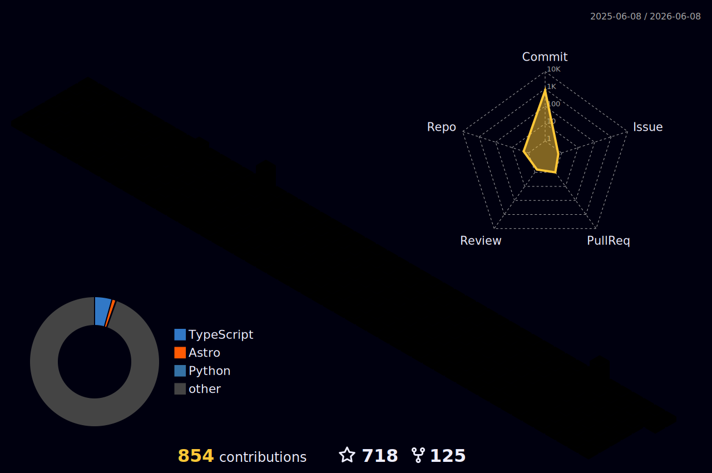

## Hey 👋, I'm 大赵同学!

<!--  -->

 

 
 

 
 
**🧐  About Me:**

I am a individual developer from China. I like open source and all interesting things and want to try to do it.

I want to be an interesting person and create something that can be remembered by others.

- 🔭 I’m currently working on BYD.
- ☁️ I aspire to be a front-end engineer.
- 🌱 I’m currently learning Vue & Flutter & React, and want to learn everything interesting.
- 🤔 I want to make a Vue-backstage management system recently.
- ❤️ I like eating 🍉, raising 🐓, reading 📖, sleeping in 🛌 and watching 📺 [ACGN](https://en.wikipedia.org/wiki/ACG_(subculture)).
- 📝   Checkout my [Notes/Doc](https://zain-doc.vercel.app/)
- 💬 Be free to ask me about anything [here](https://github.com/webyang-male/webyang-male/issues).

### 🧰 Code Languages & Tools:

 
 

 
 

### 🎯GitHub Contributions

 

### 🏆️ Github Profile Trophy
<!-- GitHub数据统计 -->

  

  

 
 

